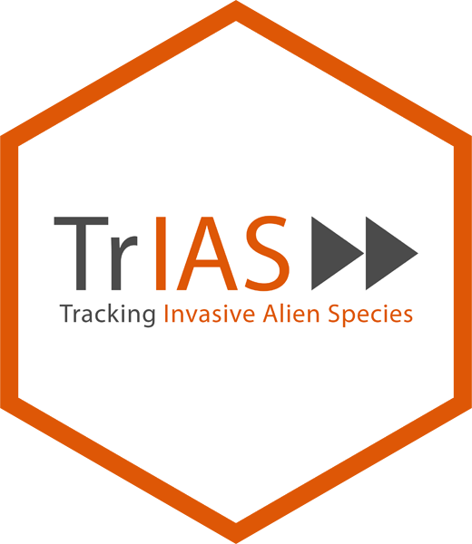

# trias 

[](https://travis-ci.org/trias-project/trias)

R package with functions for TrIAS (Tracking Invasive Alien Species) project. 

## Installation

```r
install.packages("rgbif")
```

Alternatively, install development version

```r
install.packages("devtools")
devtools::install_github("trias-project/trias")
```

```r
library("trias")
```

## Get started

To get started, see:

* [Function reference](https://trias-project.github.io/trias/reference/index.html): an overview of all `trias` functions.
